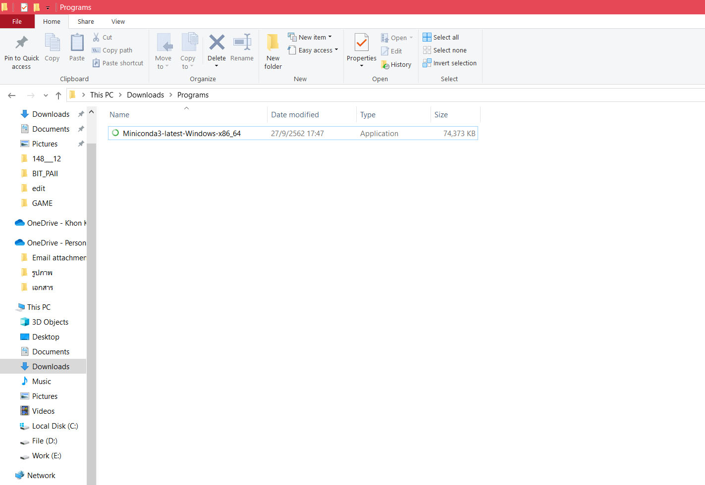

# python_dataviz
## การบ้านครั้งที่ 1
วิชา SC623405 Basic Python and Data Visualization
## ชื่อ-สกุล รหัสนักศึกษา
นางสาวขวัญจิรา คำสรดี 603021106-3
# 1. วิธีติดตั้งโปรแกรม Anaconda 
    - เป็นโปรแกรมช่วย install python
วิธีติดตั้ง มีดังนี้

1. ค้นหาคำว่า Miniconda 

2. ถ้าคอมพิวเตอร์เป็น Windows เลือกดาวน์โหลดในหมวด Windows installers มี 2 เวอร์ชั่นให้เลือกดาวน์โหลด เลือกเวอร์ชั่นที่เป็นเวอร์ชั่นล่าสุดคือ Python 3.7 จะมีแบบ 64 bit และ 32 bit ให้เลือกดาวน์โหลดตามคุณสมบัติของคอมพิวเตอร์

3. หลังจากดาวน์โหลดเสร็จแล้ว ให้เปิดโฟลเดอร์ที่ดาวน์โหลดขึ้นมา 

4. เปิดไฟล์ที่ชื่อว่า Miniconda3 เพื่อทำการติดตั้งโปรแกรมโดยให้กด Next ไปเรื่อยๆ 

จนเจอคำว่า Finish ให้กด Finish แสดงว่าติดตั้งเสร็จเรียบร้อยแล้ว

5. เปิดโปรแกรม Anaconda Prompt(Miniconda3) จากนั้นพิมพ์ python แล้วกด enter เพื่อเช็คดูว่าติดตั้งสำเร็จพร้อมใช้งานหรือไม่ หากติดตั้งสำเร็จจะขึ้นข้อความดังภาพ

6. ทดลองใช้คำสั่ง print โดยพิมพ์ print('') หรือ print("") ในเครื่องหมาย '' หรือ "" จะเป็นข้อมควาที่ต้องการแสดงผล

7. ถ้าต้องการออกให้พิมพ์ exit() แล้ว enter จะต้องทำการ exit() ก่อนที่จะ install package

8. วิธี install package matplotlib
    - พิมพ์ conda install matplotlib
    - เมื่อขึ้นว่า Proceed ([y]/n)? ให้พิมพ์ y จากนั้นรอดาวน์โหลดจนเสร็จจะขึ้นว่า done

9. วิธี install package jupyter
    - พิมพ์ conda install jupyter
    - เมื่อขึ้นว่า Proceed ([y]/n)? ให้พิมพ์ y จากนั้นรอดาวน์โหลดจนเสร็จจะขึ้นว่า done

10. สร้างโฟลเดอร์เก็บโค้ด โดย cd " " ในเครื่องหมาย " " จะเป็นที่อยู่ของโฟลเดอร์ 

11. พิมพ์ jupyter notebook แล้ว enter เพื่อเปิดใช้งาน jupyter

จะเด้งขึ้นมาที่หน้าบราวเซอร์ jupyter

12. การใช้งาน jupyter เป็นโปรแกรมที่ใช้เขียน python
    - ไปที่ New -> Python 3

    - กดที่ Untitled
    - พิมพ์ชื่อไฟล์ที่ต้องการตั้ง แล้วกด Rename

    - ลองใช้คำสั่ง print('') เพื่อแสดงผล
    - หากกด enter จะเป็นการขึ้นบรรทัดใหม่ หากต้องการ run ให้กด shift + enter

    - กด save ตามภาพ

    - หากยังขึ้นว่า runing ให้กดช่องสี่เหลี่ยมที่หน้าไฟล์ที่ต้องการให้หยุด run แล้วกด shutdown

    - หากต้องการหยุด run ใน anaconda prompt ให้กด ctrl + c

# 2. วิธีใช้ Google Colab
1. ค้นหา Google Colab

2. สร้างไฟล์ใหม่ที่ NEW PYTHON 3 NOTEBOOK

3. กดที่ Untitled เพื่อเปลี่ยนชื่อ

4. ลองใช้คำสั่ง print('') เพื่อแสดงผล
    - หากจะ run ให้กด shift + enter

5. หากต้องการ save ให้กดที่ File -> Save หรือ ctrl + s

6. หากต้องการ download ให้กด File -> Download .ipynb

# วิธีใช้งาน Github
1. หากยังไม่มีชื่อผู้ใช้ให้ทำการ Sign up แต่ถ้าหากมีชื่อผู้ใช้อยู่แล้วให้ sign in

2. Create a new repository ตั้ง repository name เป็น python_dataviz

3. ติดตั้ง Github ใน Anaconda prompt โดยพิมพ์ conda install -c anaconda git

4. เปิดไปที่ GitHub แล้วกดที่ Clone or download จากนั้น copy URL

5. พิมพ์ git clone ตามด้วย URL ที่ copy มา เพื่อทำการเชื่อมงานที่อยู่บน GitHub กับเครื่องคอมพิวเตอร์

6. พิมพ์ git status เพื่อดูว่า ไฟล์ไหนที่ยังไม่เชื่อมกับไฟล์บนเน็ต หากมีไฟล์ที่ยังไม่เชื่อมให้พิมพ์ git add ตามด้วยชื่อไฟล์นั้น

7. จากนั้นพิมพ์ git commit -m " " คล้ายกับการ comment เพื่อบอกว่าเราทำอะไรกับไฟล์นี้อยู่  

8. พิมพ์ git push เพื่อดันงานที่อยู่บนคอมไปไว้บน GitHub บนอินเทอร์เน็ต

